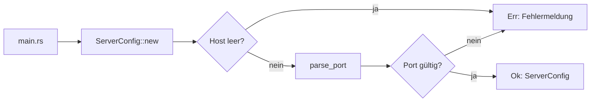

# 05 – Server-Konfiguration

## Ziel

Host und Port zu einem sicheren Konfigurationsobjekt bündeln.

`ServerConfig::new("localhost", "8080")` validiert beide Eingaben und liefert
entweder eine Konfiguration oder eine Fehlermeldung.

```rust
match ServerConfig::new("localhost", "8080") {
    Ok(config) => println!("{}:{}", config.host(), config.port()),
    Err(message) => println!("Configuration error: {message}"),
}
```

## Was neu ist

- `ServerConfig` ist ein `struct` mit privaten Feldern.
- `new` ist ein Konstruktor-ähnlicher Associated Function.
- `host()` und `port()` sind lesende Methoden (Getter).
- `?` in `new` gibt einen Fehler von `parse_port` direkt zurück.

## Ablauf im Programm



`main.rs` entscheidet mit `match`, ob es eine gültige Konfiguration verwenden
oder eine Fehlermeldung ausgeben soll.

## Tests

`tests/server_config_test.rs` prüft:

- gültigen Host und Port,
- leeren Host,
- ungültigen Port.

Noch läuft kein Netzwerkserver. Wir haben bisher nur die Konfiguration gebaut,
die ein späterer Server benutzen wird.
