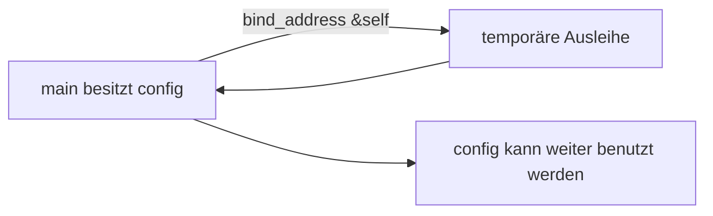

# 07 – `self` versus `&self`

## Die wichtigste Frage

**Übernimmt die Methode den Wert oder leiht sie ihn nur aus?**

```rust
pub fn bind_address(self) -> String
```

`self` bedeutet: Die Methode übernimmt den Besitz der ganzen `ServerConfig`.
Nach dem Aufruf kann der Aufrufer `config` nicht mehr verwenden.

```rust
pub fn bind_address(&self) -> String
```

`&self` bedeutet: Die Methode leiht die `ServerConfig` nur aus. Sie darf lesen,
aber der Besitz bleibt beim Aufrufer.

## Warum entsteht bei `self` ein Fehler?

```rust
let address = config.bind_address();
println!("Server will listen on {address}");
println!("Port is {}", config.port()); // Compilerfehler bei `self`
```

Bei `bind_address(self)` wurde `config` schon an die Methode übergeben.
Die letzte Zeile versucht, einen Wert zu benutzen, der nicht mehr dem Aufrufer
gehört. Rust meldet diesen Fehler direkt im Editor, vor dem Starten.

Mit `bind_address(&self)` ist derselbe Code erlaubt.

## Aufräumen (`Drop`)

Wenn eine Methode `self` besitzt, endet dieser Wert am Ende der Methode.
Dann räumt Rust ihn automatisch auf:


Das ähnelt einem Destruktor. Rust ruft `Drop` auf, falls der Typ ihn
implementiert; ansonsten werden seine Felder automatisch aufgeräumt.

Bei einer Ausleihe gibt es keinen Besitzübergang:



## Regel für unsere Methoden

- `&self`: Die Methode liest nur Daten. Das ist unser Fall bei `bind_address`.
- `&mut self`: Die Methode verändert den Wert, aber übernimmt ihn nicht.
- `self`: Die Methode soll den Wert übernehmen oder in etwas Neues umwandeln.
