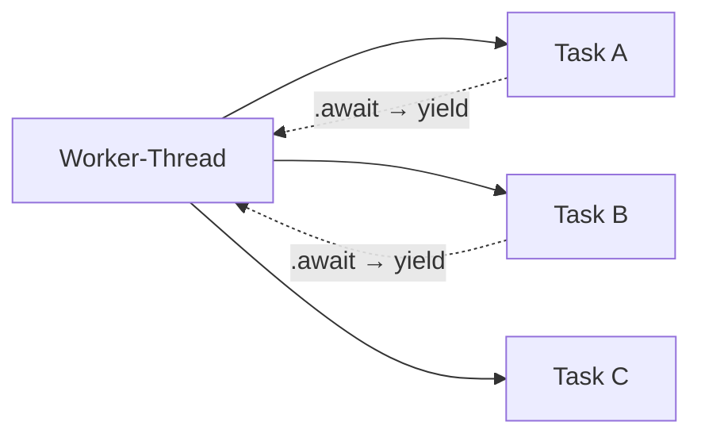
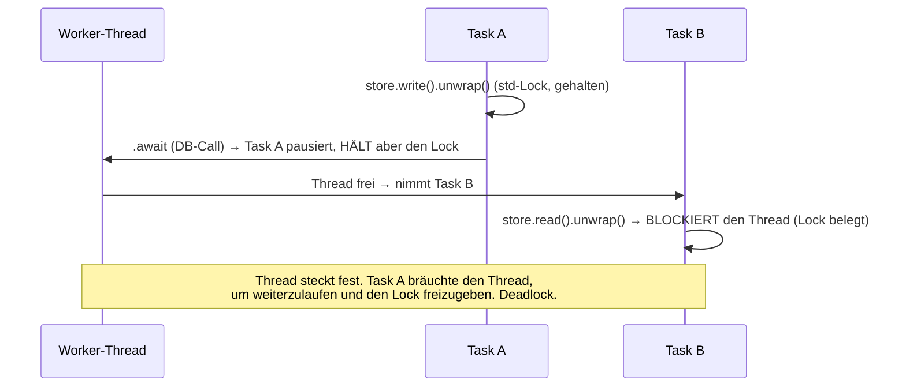
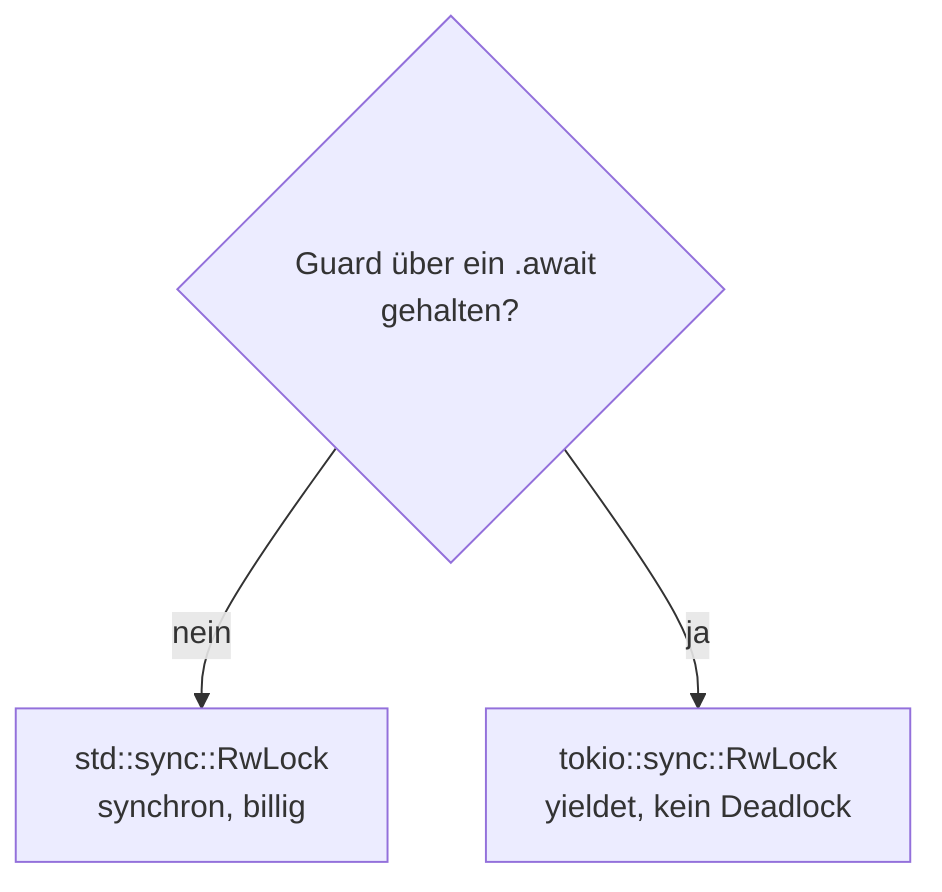

# Konzept: `std::sync::RwLock` vs. `tokio::sync::RwLock`

> Konzept-Notiz (kein Lektions-Doc). Nachschlagen, wann welcher Lock in async-Code.

## Der Unterschied in einem Satz

**`std::sync::RwLock` blockiert den OS-Thread beim Warten. `tokio::sync::RwLock`
gibt den Thread frei (yieldet).**

Beide schützen Daten vor gleichzeitigem Zugriff. Der Unterschied zeigt sich nur,
wenn der Lock **belegt** ist und du warten musst.

## Wie ein tokio-Worker Tasks bedient

Ein Runtime-Worker (ein OS-Thread) bedient viele Tasks. An jedem `.await`-Punkt
darf ein Task pausieren und den Thread für einen anderen Task freigeben.



Solange ein Task **nicht** an einem `.await` pausiert (z. B. weil er blockierend
wartet), kann der Worker **nichts anderes** tun.

## std-Lock: synchron, blockierend

```rust
use std::sync::RwLock;

let lock = RwLock::new(0);

let guard = lock.read().unwrap();   // KEIN .await — sofort oder Thread blockiert
println!("{}", *guard);
```                                 // guard fällt hier

`read()`/`write()` geben **sofort** einen Guard zurück — oder blockieren den
ganzen OS-Thread, bis der Lock frei ist. Kein `.await`, kein Yield.

## tokio-Lock: asynchron, yieldend

```rust
use tokio::sync::RwLock;

let lock = RwLock::new(0);

let guard = lock.read().await;      // MIT .await — Task yieldet, wenn belegt
println!("{}", *guard);
```                                 // guard fällt hier

`read()`/`write()` geben ein **Future** zurück. Ist der Lock belegt, gibt der
Task den Worker frei und läuft weiter, sobald der Lock frei ist.

## Das Deadlock-Szenario (warum es zählt)

Der gefährliche Fall: einen **std-Lock über ein `.await` halten**.



```rust
// ❌ std-Lock über ein .await gehalten:
let guard = store.write().unwrap();   // Lock genommen
some_async_db_call().await;           // Task pausiert MIT gehaltenem Lock → Gefahr
// Ein anderer Task, der store.read() will, blockiert den ganzen Worker.
```

Mit `tokio::sync::RwLock` würde Task B am `.await` **yielden** statt zu
blockieren → Task A käme dran, gäbe den Lock frei. Kein Deadlock.

## Die Regel

> **Lebt der Guard über einen `.await`-Punkt?**
> - **Nein** → `std::sync::RwLock` (schneller, kein async-Overhead)
> - **Ja** → `tokio::sync::RwLock` (yieldet statt zu blockieren)

Das ist eine Eigenschaft **deines Codes**, kein Feature des Lock-Typs. Beide
funktionieren in async-Code — die Frage ist nur die Haltedauer.



## Warum bei unserem Store `std` reicht

Der Store ist ein reines `HashMap`. Die Operationen sind **synchron und
mikroskopisch kurz** — kein `.await` zwischen Lock und Freigabe:

```rust
let mut store = self.items.write().unwrap();   // lock
store.insert(id, item);                        // synchron, blitzschnell
// guard fällt am Statement-Ende — KEIN .await dazwischen
```

Erst wenn wir *innerhalb* des Locks etwas `.await`en würden (z. B. `db.query()`
bei gehaltenem Lock — was man ohnehin vermeidet), bräuchten wir den tokio-Lock.
Bei einem In-Memory-`HashMap` passiert das nie → **`std::sync::RwLock`** ist
korrekt und billiger.

## Bonus: warum `RwLock` und nicht `Mutex`?

`Mutex` lässt immer nur **einen** Zugriff zu (Lesen wie Schreiben). `RwLock`
erlaubt **viele gleichzeitige Leser** ODER **einen Schreiber**. Für einen Store,
der überwiegend gelesen wird (viele `get`, wenige `insert`), heißt das: `get`s
laufen parallel, statt sich zu serialisieren. ⚡ Der Performance-Grund.
